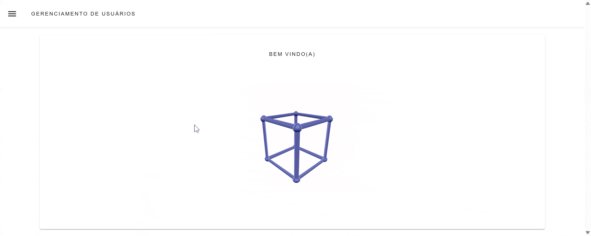

# 👤 Vuetify User Manager

## 🌟 Recursos
✅ CRUD Completo
✅ Interface Material Design
✅ Validação de Formulários  
✅ Filtros e Ordenação
✅ Tema Escuro/Claro

## 🛠 Tecnologias
- Vue.js 3
- Vuetify 3
- Pinia
- Axios

## 🚀 Como Executar
1. git clone https://github.com/RafaelCastro137/vuetify-user-manager.git
2. cd vuetify-user-manager
3. npm install
4. npm run dev

## 📜 Licença
MIT

